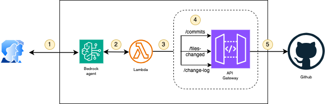

# 🧠 DevOps Utility Agent using Amazon Bedrock

This repository showcases a practical implementation of an **AI-powered DevOps assistant** built using [Amazon Bedrock Agents](https://docs.aws.amazon.com/bedrock/latest/userguide/agents.html). The agent is capable of generating, reviewing, and committing **release notes** based on GitHub commit history, with extensibility for further DevOps insights.

## 🚀 Why Amazon Bedrock?

Amazon Bedrock is used in this project to build and orchestrate the AI-powered DevOps Agent. It provides:

- **Multi-model access**: Easily run Claude 3.5 Sonnet and other models without managing infrastructure.
- **Agent orchestration**: Tools like `getCommits` and `pushChangelog` are auto-invoked via Action Groups and OpenAPI.
- **Scalability and security**: Bedrock integrates with IAM, CloudWatch, and VPC for secure, enterprise-grade deployments.
- **Low-code extensibility**: You can expand this agent with more Lambda tools or knowledge base lookups with minimal effort.

> ⚡️ Powered by **Claude 3.5 Sonnet** on Amazon Bedrock.

## 🤖 Why Claude 3.5 Sonnet for This Agent?

This project uses **Anthropic Claude 3.5 Sonnet** via Amazon Bedrock due to its strong performance in:

- **Commit analysis**: It interprets noisy or diverse Git commit messages and organizes them into categorized release notes.
- **Instruction compliance**: Claude follows structured XML-based function calls reliably, which is essential for Bedrock Agents.
- **Context retention**: It handles multi-step tasks (like generating notes and waiting for confirmation) without losing state.

Claude offers an ideal balance of capability, cost, and integration with Bedrock’s agent framework — making it well-suited for DevOps automation use cases.

---

## 🚀 Use Case

The agent helps development teams:

- Automatically **fetch recent GitHub commits**
- **Generate clean, categorized release notes** (Features, Fixes, Improvements)
- **Commit the release notes** back to the repository (`CHANGELOG.md`)
- Inspect **files changed** in recent commits 
- Retrieve **commit statistics** (authors, timestamps, line diffs, etc.) (coming soon)

---

## 📁 Folder Structure

```bash
release-notes-agent/
├── agent-prompt/              # Bedrock agent prompt, OpenAPI schema, and setup steps
│   ├── prompt.txt             # Natural language instructions for the agent
│   ├── openapi-schema.yaml    # Action group schema definition
│   └── readme.md         # Step-by-step guide to creating the agent in Bedrock
│
├── lambda/                    # Source code for Lambda functions
│   ├── devops_utility_action_group_handler.py  # Handler for Bedrock Agent integration
│   ├── devops_git_operations.py                # GitHub API logic (commits, changelog, etc.)
│   ├── readme.md              # Setup guide for deploying Lambda functions
│
├── api-gateway/               # API Gateway integration
│   ├── openapi-schema.yaml    # Swagger spec to import via console or CLI
│   └── readme.md  # Setup guide for API Gateway resource creation
│
├── architecture/
│   └── architecture-diagram.png  # High-level overview of component interaction
│
├── readme.md                  # 🌟 This file — overall project overview
└── LICENSE
```

---

## 🧰 How It Works

### 🧠 1. Bedrock Agent

- Configured with **Claude 3.5 Sonnet**
- Instruction prompt guides the agent on how to:
  - Fetch Git commits
  - Classify messages into markdown release notes
  - Ask for user confirmation
  - Commit changes using the `pushChangelog` action
- Powered by an **OpenAPI schema** defining the available actions (`/commits`, `/files-changed`, etc.)

### 🔌 2. Lambda Functions

- Exposed via **API Gateway**
- Proxies requests to GitHub's REST API using a **Personal Access Token**
- Includes logic for:
  - Fetching commits
  - Listing files changed in last N commits
  - Writing to `CHANGELOG.md` and committing

### 🌐 3. API Gateway

- Serves as the external API bridge between the agent and GitHub
- Defined via an OpenAPI (Swagger) spec
- Supports:
  - `GET /commits`
  - `GET /files-changed`
  - `POST /push-changelog`

---

## 🗂 Architecture



---

## 🧩 Extending This Agent

You can enhance the agent further by adding:

- 📊 **Commit statistics**: author-level contribution, lines added/removed
- 🧪 **CI/CD test summaries**: fetch test reports, coverage trends
- 🐘 **Infra diffs**: check recent changes in Terraform/CloudFormation
- 🔒 **Security checks**: inspect for secret commits or policy drift

To do so, simply:

1. Add a new endpoint in the Lambda handler
2. Update the API Gateway's OpenAPI schema
3. Define the action in the agent's schema
4. Update the agent prompt to guide new capabilities

---

## 🛠 Requirements

- Python 3.11 (used in Lambda functions)
- AWS account with access to:
  - Amazon Bedrock (Claude 3.5 Sonnet model access)
  - Lambda, API Gateway, IAM
- GitHub Personal Access Token (`repo` scope)

---

## 📄 License


[MIT](LICENSE)

---

## 🙌 Contributions

Pull requests are welcome if you'd like to expand the agent's DevOps capabilities further!
